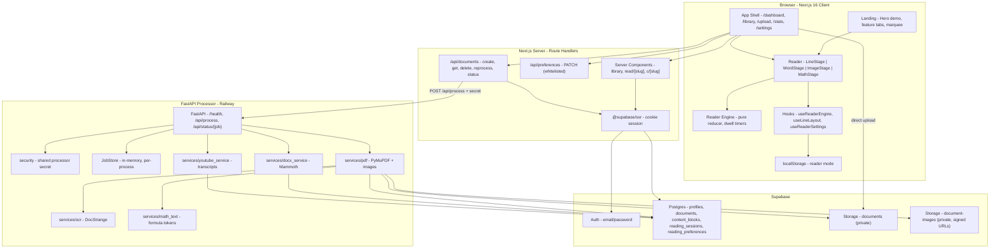
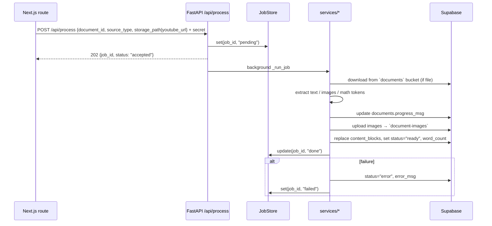
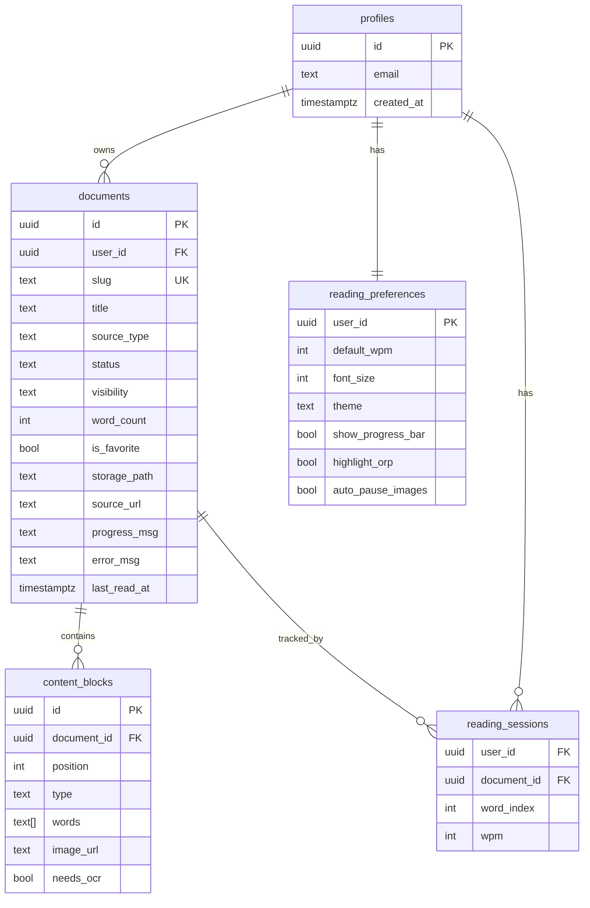

# Read/IO — Technical Architecture

> **Context**: Technical reference for the Readio speed-reading platform  
> **Target Audience**: Contributors, Reviewers, Systems Architects  
> **Last Updated**: September 2026  
> **Status**: Live (web + processor) + Roadmap  
> **Repository**: `omsenjalia/readio`

---

## Navigation Panel

| # | Section | Status | Key Technologies |
| :--- | :--- | :--- | :--- |
| [1. Executive Summary](#1-executive-summary) | System overview and innovations | Live | Next.js 16, FastAPI, Supabase |
| [2. High-Level Architecture](#2-high-level-architecture) | Browser-to-cloud topology | Live | Mermaid, App Router, Railway |
| [3. Technology Stack and Design System](#3-technology-stack-and-design-system) | Frameworks and design tokens | Live | React 19, Tailwind 4, Inter / Newsreader |
| [4. Repository Structure](#4-repository-structure) | Codebase layout | Live | Monorepo: `web/`, `backend/`, `supabase/` |
| [5. Environment Variables and Secrets](#5-environment-variables-and-secrets) | Config and credential isolation | Live | `.env.local`, shared processor secret |
| [6. Reader Engine Architecture](#6-reader-engine-architecture) | RSVP state machine, ORP, Line Flow | Live | Pure reducer, `Intl.Segmenter`, layout effects |
| [7. Web App Architecture](#7-web-app-architecture) | Routes, hooks, components | Live | App Router, route groups, `@supabase/ssr` |
| [8. Document Processing Pipeline](#8-document-processing-pipeline) | Ingestion and extraction | Live | PyMuPDF, Mammoth, youtube-transcript-api, DocStrange OCR |
| [9. Data Flow and Request Lifecycle](#9-data-flow-and-request-lifecycle) | Upload → process → read | Live | Signed uploads, 202 + polling |
| [10. Data Model and Row-Level Security](#10-data-model-and-row-level-security) | Postgres schema and RLS | Live | Supabase Postgres, Storage buckets |
| [11. API Contract Reference](#11-api-contract-reference) | REST contract | Live | `/api/documents`, `/api/process`, `/api/preferences` |
| [12. Internationalization and Script Support](#12-internationalization-and-script-support) | Indic script rendering | Live | Grapheme clusters, Noto Sans Gujarati / Devanagari |
| [13. Security Model](#13-security-model) | Auth, RLS, secret handling | Live | Supabase Auth, HMAC compare, private buckets |
| [14. Testing and Quality Gates](#14-testing-and-quality-gates) | Unit tests and CI | Live | Vitest, pytest, ruff, ESLint |
| [15. Deployment and Release Architecture](#15-deployment-and-release-architecture) | Hosting and CI/CD | Live | Vercel, Railway, GitHub Actions |
| [16. Known Limitations](#16-known-limitations) | Documented constraints | Live | In-memory job store, transcript scraping |
| [17. Future Roadmap and Planned Enhancements](#17-future-roadmap-and-planned-enhancements) | Roadmap | Planned | Extension, comprehension telemetry, TTS |

---

## 1. Executive Summary

**Read/IO** is a web-based speed reader built around **Line Flow**: the whole current line slides beneath a single fixed focus point so that the **Optimal Recognition Point (ORP)** character of every word lands exactly where the eye is already resting. The eyes never move; the text does. A classic one-word **RSVP** (Rapid Serial Visual Presentation) mode is included alongside it.

Users upload a document (PDF, DOCX, plain text / Markdown) or paste a YouTube link, receive a shareable link, and read at **100–800 WPM**.

- **Frontend**: Next.js 16 (App Router, `src/` layout), React 19, TypeScript, Tailwind CSS 4
- **Backend**: Python 3.11+ / FastAPI document-processing microservice
- **Platform**: Supabase (Auth, Postgres with RLS, Storage)
- **Extraction**: PyMuPDF (PDF), Mammoth (DOCX), youtube-transcript-api (YouTube), Nanonets DocStrange (OCR for scanned PDFs)
- **Reader**: Dual-mode RSVP engine with measured ORP alignment and Unicode-aware grapheme handling

### Core Innovations

- **Line Flow**: full-line horizontal strip pinned to the focused word's ORP; neighbouring lines dimmed above and below for peripheral context
- **Measured, not guessed, alignment**: a layout effect reads the real offset of the ORP glyph after each render and writes the strip transform before paint — no flash of misaligned text
- **Pure reducer playback engine**: index / playing / dwell state lives in a single immutable object (`lib/reader-engine.ts`), eliminating a class of stale-ref bugs
- **Content-aware dwell**: playback auto-pauses on figures and math formulas with an on-screen countdown (`DwellOverlay`)
- **Script-aware ORP**: grapheme-cluster segmentation so Gujarati and Devanagari pivot letters highlight correctly
- **Public playground at `/demo`**: the real reader on sample text, no account required
- **Design tokens**: single white-first theme with an emerald accent and a deliberate **red ORP pivot** (`--color-orp`, `#dc2626`), every pair verified WCAG AA

---

## 2. High-Level Architecture



---

## 3. Technology Stack and Design System

### 3.1 Web Client

| Layer | Package | Version | Purpose |
| :--- | :--- | :--- | :--- |
| Framework | `next` | 16.3.5 | App Router, RSC, route handlers |
| UI | `react` / `react-dom` | 19.2.8 | Rendering |
| Language | TypeScript | ^5 | Typed client + server code |
| Styling | `tailwindcss` / `@tailwindcss/postcss` | ^4 | Utility CSS over a token layer |
| Auth / DB client | `@supabase/ssr`, `@supabase/supabase-js` | ^0.12.7 / ^2.116 | Cookie-based sessions, RLS-scoped queries |
| Icons | `lucide-react` | ^1.45 | Iconography |
| Feedback | `react-hot-toast` | ^2.6 | Toasts |
| IDs | `nanoid` | ^6 | Short document slugs |
| Fonts | `@fontsource-variable/inter`, `newsreader`, `noto-sans-gujarati`, `noto-sans-devanagari` | ^5.3 | Self-hosted variable fonts |
| Tests | `vitest` | ^5 | Unit tests for `src/lib` |

### 3.2 Processor Service

| Layer | Package | Version | Purpose |
| :--- | :--- | :--- | :--- |
| Framework | `fastapi` / `starlette` | 0.141 / 1.6 | HTTP API |
| Server | `uvicorn` (+ `uvloop`, `httptools`) | 0.52 | ASGI runtime |
| Validation | `pydantic` | 2.13 | Request / response models |
| PDF | `pymupdf` | 1.28 | Text + image extraction |
| DOCX | `mammoth` | 1.12 | DOCX → text |
| YouTube | `youtube-transcript-api` | 1.2 | Transcript fetch |
| OCR | Nanonets DocStrange (HTTP) | — | Scanned-PDF fallback |
| DB / Storage | `supabase` | 2.31 | Service-role writes |
| Lint / Test | `ruff`, `pytest` | 0.16 / — | Quality gates |

### 3.3 Design System

Defined entirely in `web/src/app/globals.css` as CSS custom properties.

| Token group | Values | Notes |
| :--- | :--- | :--- |
| Ground / surface | `#f4f8f4` / `#ffffff` | Single white theme; no dark or sepia mode |
| Ink | `#101a13` near-black | 16.6 : 1 on ground |
| Muted / subtle | `#55665a` / `#5f7265` | Both clear WCAG AA |
| Accent | Emerald `#047857` (hover `#065f46`) | CTAs, links, pills, progress bar |
| **ORP pivot** | Red `#dc2626` (`--color-orp`) | Deliberate second colour so the fixation point reads at a glance |
| Primitives | `.btn-primary\|outline\|ghost\|paper`, `.card`, `.pill`, `.input`, `.range-accent` | Shared across landing and app |
| Motion | Scroll-reveal, focus glows, strip slide = `stepMs` | Respects `prefers-reduced-motion` |
| Layout | Mobile-first, `dvh`, safe-area insets, bottom tab nav with centre upload button | Bottom-sheet settings on touch |

---

## 4. Repository Structure

```
readio/
├── web/                                Next.js app (App Router, src/ dir)
│   ├── src/app/
│   │   ├── (auth)/                     login, signup, logout route
│   │   ├── (app)/                      dashboard, library, upload, stats, settings
│   │   ├── api/
│   │   │   ├── documents/              route.ts, [id]/route.ts, [id]/status, [id]/reprocess
│   │   │   └── preferences/            PATCH with whitelist validation
│   │   ├── read/[slug]/                Owner reader
│   │   ├── c/[slug]/                   Public / shared reader (+ error, not-found)
│   │   ├── demo/                       Public playground, no auth
│   │   ├── globals.css                 Design tokens + primitives
│   │   └── layout.tsx, page.tsx        Root layout, landing
│   ├── src/components/
│   │   ├── landing/                    SiteNav, HeroDemo, FeatureTabs, Sections, Marquee, Reveal, RotatingWord, SiteFooter
│   │   ├── reader/                     LineStage, WordStage, OrpWord, ImageStage, MathStage, DwellOverlay,
│   │   │                               ReaderControls, ReaderHeader, ReaderProgressBar, SettingsPanel, SliderRow, Popover
│   │   ├── library/                    MenuAction
│   │   └── AppShell, Reader, DragDrop, LibraryTable, SettingsForm, ShareModal, ConfirmDeleteDialog, SourceBadge, Brand
│   ├── src/hooks/                      useReaderEngine, useReaderSettings, useLineLayout, useReadingMode,
│   │                                   useMediaQuery, useDocumentStatusPolling
│   └── src/lib/                        Pure logic + tests:
│                                       tokenize, orp, lines, flatten, math, markdown, youtube, reader-engine,
│                                       reader-mode, preferences(-schema|-api), documents(-api), processor,
│                                       progress, share, images, format, constants, supabase/
├── backend/                            FastAPI processor (Railway root)
│   ├── main.py                         App factory, lifespan, /health
│   ├── routers/process.py              POST /api/process, GET /api/status/{job_id}
│   ├── jobs.py                         Thread-safe in-memory JobStore
│   ├── security.py                     Shared-secret dependency
│   ├── db.py, models.py                Supabase client, Pydantic models
│   ├── services/                       pdf, docx_service, youtube_service, text_service, ocr, math_text, documents
│   ├── tests/                          test_api, test_documents, test_security, test_text_service, test_youtube_service
│   ├── Dockerfile, requirements*.txt, ruff.toml, pytest.ini
├── supabase/migrations/                Schema, RLS, buckets, theme defaults (9 migrations)
├── docs/                               This file, README (product analysis), redesign audit + screenshots
├── .github/workflows/ci.yml            Web + backend CI
└── dev.sh                              Runs both services locally
```

---

## 5. Environment Variables and Secrets

### 5.1 `web/.env.local`

| Variable | Required | Purpose |
| :--- | :--- | :--- |
| `NEXT_PUBLIC_SUPABASE_URL` | Yes | Supabase project URL (public) |
| `NEXT_PUBLIC_SUPABASE_ANON_KEY` | Yes | Anon key; all queries are RLS-scoped |
| `PROCESSOR_URL` | Yes* | Processor base URL. *Only required for PDF / DOCX / YouTube — plain text is tokenized in-process |
| `PROCESSOR_SECRET` | Yes* | Shared secret sent as `Authorization: Bearer` to the processor |

### 5.2 `backend/.env`

| Variable | Required | Purpose |
| :--- | :--- | :--- |
| `SUPABASE_URL` | Yes | Supabase project URL |
| `SUPABASE_SERVICE_ROLE_KEY` | Yes | Service-role key; bypasses RLS for writes |
| `PROCESSOR_SECRET` | Yes | Must equal the web value. The placeholder `change-me-in-production` is treated as **unset** (503) |
| `DOCSTRANGE_API_KEY` / `NANONETS_API_KEY` | No* | OCR for image-only PDFs. *Required only when a scanned PDF is encountered |

### 5.3 Isolation Rules

- The service-role key never reaches the browser or the Next.js server; only the processor holds it.
- `PROCESSOR_SECRET` is compared with `hmac.compare_digest` and accepted via `Authorization: Bearer …` or `X-Processor-Secret`.
- CI builds the web app with placeholder Supabase values; no real credentials are stored in the repository.

---

## 6. Reader Engine Architecture

### 6.1 Playback State Machine (`lib/reader-engine.ts`)

A pure reducer replaces the previous dozen `useState` atoms.

```ts
interface EngineState {
  index: number;        // current ReadItem
  playing: boolean;
  dwell: "none" | "image" | "math";
  dwellMs: number;      // total dwell duration
  remainingMs: number;  // countdown for DwellOverlay
}

type EngineAction =
  | { type: "toggle-play" }
  | { type: "step"; delta: number }     // applies arrival rules
  | { type: "seek"; index: number }     // no arrival rules (resume)
  | { type: "advance" }                 // stop at end
  | { type: "resume" }
  | { type: "set-remaining"; ms: number };
```

Every index change passes through a single `enterItem` transition that clears any active dwell before deciding whether the new item requires one. This structurally eliminates two historical defects: a stale image-dwell timer resuming playback after the user stepped away, and `playing` being read through a ref in one code path and state in another.

`useReaderEngine` wraps the reducer, owns the `setInterval` driven by `60000 / wpm`, and exposes `play / pause / step / goTo`.

### 6.2 Optimal Recognition Point (`lib/orp.ts`)

| Content graphemes | ORP index |
| :--- | :--- |
| ≤ 1 | 0 |
| 2–5 | 1 |
| 6–9 | 2 |
| 10–13 | 3 |
| ≥ 14 | 4 |

Words are split into grapheme clusters via `Intl.Segmenter` (falling back to `Array.from`). Only clusters matching `\p{L}|\p{N}` count as content, so leading punctuation and combining marks do not shift the pivot. `splitAtORP` returns `{ before, orp, after }` for rendering.

### 6.3 One-word mode (`WordStage` + `OrpWord`)

`OrpWord` measures the rendered width of `before` and `orp` and translates the word so the pivot glyph's centre sits on the stage's centre axis. Faded previous / next words are shown as previews.

### 6.4 Line Flow (`LineStage` + `useLineLayout` + `lib/lines.ts`)

1. `lib/lines.ts::layoutLines` greedily packs word items into rows from **measured** text metrics (canvas `measureText` with the resolved webfont), producing `LayoutRow[]` and an `Int32Array` word→row index.
2. `useLineLayout` re-measures on container resize, font-size change, and `document.fonts.ready`.
3. `LineStage` renders the current row as a horizontal strip. A `useLayoutEffect` reads the focused word's ORP span offset and sets `transform: translateX(...)` **before paint**; the CSS transition duration equals `stepMs`, so the strip glides at exactly the reading cadence.
4. Previous and next rows are rendered dimmed above and below (`showContext`), disabled in the landing hero.

### 6.5 Content items (`lib/flatten.ts`)

`content_blocks` are flattened into a linear `ReadItem[]` of `word | image | math` items. Images and math tokens (`lib/math.ts::isMathToken`) trigger dwell (`SPECIAL_DWELL_MS = 15 000`), rendered by `ImageStage` / `MathStage` with `DwellOverlay`.

### 6.6 Controls

| Input | Action |
| :--- | :--- |
| `Space` | Play / pause (or dismiss dwell) |
| `←` / `→` | Step one word |
| `↑` / `↓` | ± 25 WPM (100–800) |
| `M` | Toggle One word ↔ Line Flow (persisted in `localStorage` via `lib/reader-mode.ts`) |
| `F` | Fullscreen |
| Touch | Swipe / edge-tap to step, centre-tap to toggle |

---

## 7. Web App Architecture

### 7.1 Route Groups

| Group | Routes | Auth | Rendering |
| :--- | :--- | :--- | :--- |
| Marketing | `/` | Public | Server + client islands (HeroDemo) |
| `(auth)` | `/login`, `/signup`, `/logout` | Public | Client forms → Supabase Auth |
| `(app)` | `/dashboard`, `/library`, `/upload`, `/stats`, `/settings` | Required | Server components + `loading.tsx` / `error.tsx` |
| Reader | `/read/[slug]` | Owner | Server fetch → client `Reader` |
| Share | `/c/[slug]` | Public if `visibility = 'public'` | RLS decides; `not-found.tsx` otherwise |
| Demo | `/demo` | Public | Static sample text |

### 7.2 State Ownership

| Concern | Owner | Persistence |
| :--- | :--- | :--- |
| Playback (index, playing, dwell) | `useReaderEngine` | Position synced to `reading_sessions` via `lib/progress.ts` |
| Preferences (WPM, font, ORP, auto-pause) | `useReaderSettings` | `reading_preferences` via `PATCH /api/preferences` |
| Reader mode | `useReadingMode` | `localStorage` (per device) |
| Processing status | `useDocumentStatusPolling` | Polls `GET /api/documents/[id]/status` |
| Session | `@supabase/ssr` | HTTP-only cookies |

### 7.3 `AppShell`

Responsive shell: sidebar on ≥ md, bottom tab bar with a raised centre upload button on mobile; settings open as a bottom sheet under `md`.

---

## 8. Document Processing Pipeline

### 8.1 Source Types

| Client `source_type` | Processor type | Path |
| :--- | :--- | :--- |
| `text`, `txt` | `text` | **Inline** in Next.js: `prepareReadableText` → `tokenizeText` → `chunkWords(80)` → insert `content_blocks`. Never touches the processor. |
| `pdf` | `pdf` | Processor: PyMuPDF text + images; `needs_ocr` blocks fall back to DocStrange |
| `docx` | `docx` | Processor: Mammoth → text |
| `youtube` | `youtube` | Processor: transcript (`en`, `en-US`, `en-GB`) → sentence-split paragraphs (~300 chars) |

### 8.2 Processor Sequence



### 8.3 Tokenization (`lib/tokenize.ts`)

Whitespace split with punctuation kept attached to words, math expressions preserved as single tokens, and paragraphs chunked into ≤ 80-word `content_blocks` rows to keep array columns small.

---

## 9. Data Flow and Request Lifecycle

### 9.1 Upload → Read

1. **Client** uploads the file directly to the private `documents` bucket (`userId/…`) using the anon key; RLS allows owner-scoped insert.
2. **Client** calls `POST /api/documents` with `{ source_type, storage_path | youtube_url | raw_text, title }`.
3. **Route handler** creates a `documents` row (`slug = nanoid`, `status = 'processing'`).
   - Text: processed inline, status flipped to `ready` in the same request.
   - Otherwise: `notifyProcessor` is called inside `after()` so the response returns immediately; failure to reach the processor calls `markDocumentError`.
4. **Client** navigates to `/read/[slug]`; `useDocumentStatusPolling` polls until `ready` or `error`, surfacing `progress_msg`.
5. **Reader** loads `content_blocks` ordered by `position`, flattens, and starts the engine at the saved `reading_sessions.word_index`.

### 9.2 Share

`ShareModal` toggles `documents.visibility` to `public` and copies `/c/[slug]`. Anonymous readers hit the "Anyone can read public documents" policy; content blocks and signed image URLs follow document access.

### 9.3 Reprocess / Delete

- `POST /api/documents/[id]/reprocess` — re-queues the same storage object.
- `DELETE /api/documents/[id]` — cascades `content_blocks` and `reading_sessions`; storage objects removed via delete policies on both buckets.

---

## 10. Data Model and Row-Level Security



### 10.1 RLS Summary

| Table / Bucket | Policy |
| :--- | :--- |
| `profiles` | Read own; created by `on_auth_user_created` trigger (security definer) |
| `documents` | Owners: all. Anyone: select where `visibility = 'public'` |
| `content_blocks` | Select follows document access; owner insert / update / delete (needed for inline text) |
| `reading_sessions`, `reading_preferences` | Owner: all |
| `documents` bucket | Private; owner insert / read / delete |
| `document-images` bucket | Private; select for anyone who can read the parent document; served by signed URLs |

### 10.2 Migrations (chronological)

`database_schema_and_rls` → `add_progress_msg` → `documents_storage_bucket` → `add_needs_ocr` → `add_document_images_storage_policies` → `content_blocks_owner_write_and_storage_cleanup` → `storage_path_and_private_images` → `dark_first_theme_defaults` → `white_default_theme`.

---

## 11. API Contract Reference

### 11.1 Next.js Route Handlers (session-authenticated)

| Method | Path | Body / Params | Response |
| :--- | :--- | :--- | :--- |
| `POST` | `/api/documents` | `{ source_type, storage_path?, youtube_url?, raw_text?, title?, format? }` | `201 { id, slug, status }` |
| `GET` | `/api/documents/[id]` | — | Document row |
| `DELETE` | `/api/documents/[id]` | — | `204` |
| `GET` | `/api/documents/[id]/status` | — | `{ status, progress_msg, error_msg, word_count }` |
| `POST` | `/api/documents/[id]/reprocess` | — | `202` |
| `PATCH` | `/api/preferences` | Subset of `{ default_wpm, font_size, theme, show_progress_bar, highlight_orp, auto_pause_images }` | Sanitized row. Unknown keys dropped, numbers clamped to `WPM_MIN..WPM_MAX` / `FONT_MIN..FONT_MAX` |

### 11.2 Processor (shared-secret authenticated)

| Method | Path | Body | Response |
| :--- | :--- | :--- | :--- |
| `GET` | `/health` | — | `{ status: "ok" }` (no DB touch) |
| `POST` | `/api/process` | `{ document_id, source_type, storage_path?, youtube_url? }` | `202 { job_id, status: "accepted", message }` |
| `GET` | `/api/status/{job_id}` | — | `{ job_id, status: pending\|running\|done\|failed, document_id?, error? }` or `404` |

Missing / placeholder secret → `503`; wrong secret → `401`.

---

## 12. Internationalization and Script Support

- **Grapheme-aware ORP**: `Intl.Segmenter` ensures a Gujarati or Devanagari consonant + matra cluster is treated as one unit; the pivot never lands inside a combining mark.
- **Fonts**: `noto-sans-gujarati` and `noto-sans-devanagari` are self-hosted and added to the font stack; `useLineLayout` waits for `document.fonts.ready` before measuring so Line Flow metrics match the rendered script.
- **Measured layout** rather than character-count heuristics (`layoutLinesByChars` exists only as a fallback) keeps line breaking correct for wide Indic glyphs.
- **UI copy** is English-only today; the token system and layout are RTL-neutral but untested for RTL scripts.

---

## 13. Security Model

| Layer | Mechanism |
| :--- | :--- |
| Identity | Supabase Auth (email / password), cookies via `@supabase/ssr`, server components read the session |
| Data | Postgres RLS on every table; anon key only ever executes RLS-scoped queries |
| Files | Both buckets private; images via signed URLs scoped to document readers |
| Service-to-service | `PROCESSOR_SECRET` constant-time compare; placeholder secret rejected as unconfigured |
| Input | `PATCH /api/preferences` whitelists keys and clamps ranges; `source_type` validated against an allow-list; YouTube IDs validated against `^[\w-]{11}$` |
| Secrets | Service-role key confined to the processor; CI uses placeholders |

---

## 14. Testing and Quality Gates

| Suite | Tool | Coverage |
| :--- | :--- | :--- |
| `web/src/lib/*.test.ts` | Vitest | tokenize, orp, lines, flatten, math, markdown, youtube, reader-engine, preferences-schema |
| `backend/tests/` | pytest + `fakes.py` | API (202 / 404 / auth), documents persistence, security, text service, YouTube URL parsing — no network or Supabase required |
| Lint | ESLint (`eslint-config-next`), ruff | Enforced in CI before build |
| Accessibility | Manual audit (`docs/redesign/AUDIT.md`) | All colour pairs ≥ 4.5 : 1 |

CI (`.github/workflows/ci.yml`) runs on push / PR to `main`: **web** → `npm ci`, lint, test, build; **backend** → `pip install -r requirements-dev.txt`, `ruff check`, `pytest -q`.

---

## 15. Deployment and Release Architecture

| Component | Host | Notes |
| :--- | :--- | :--- |
| Web | Vercel (Next.js) | Env: Supabase public keys, `PROCESSOR_URL`, `PROCESSOR_SECRET` |
| Processor | Railway | Root directory `backend/`, `Dockerfile`, port from `$PORT` |
| Database / Auth / Storage | Supabase | Apply **all** migrations in order |
| Local | `./dev.sh` | Backend `:8001`, web `:3000`; override with `PORT` / `WEB_PORT` |

Release flow: feature branch → PR → CI green → merge to `main` → Vercel and Railway auto-deploy.

---

## 16. Known Limitations

| Area | Limitation | Mitigation / Plan |
| :--- | :--- | :--- |
| Job store | In-memory, per-process — a status poll can hit a replica that never saw the job | Documented in `jobs.py`; move to Redis / Postgres before `--workers > 1` |
| YouTube | Transcript scraping is fragile and subject to upstream changes | Treat as best-effort; consider official captions or user-supplied transcripts |
| OCR | External paid API, per-document latency and cost | Only invoked for `needs_ocr` blocks |
| Theme | White-only by design | Dark / sepia removed deliberately; tokens allow reintroduction |
| Analytics | `/stats` reflects sessions only; no comprehension or retention telemetry | See roadmap |
| Language | Transcript languages limited to English variants; UI English-only | Extend `DEFAULT_LANGS`, add i18n layer |

---

## 17. Future Roadmap and Planned Enhancements

| Priority | Item | Rationale |
| :--- | :--- | :--- |
| P0 | Retention / comprehension telemetry (session length, return visits, optional quiz) | Needed to validate Line Flow over one-word RSVP |
| P0 | Browser extension: Line Flow any article in place | Moves usage from "upload a PDF" to a daily habit |
| P1 | Durable job queue (Postgres table or Redis) | Unblocks horizontal scaling of the processor |
| P1 | Text-to-speech synced to the pivot word | Assistive-reading use case |
| P1 | Dyslexia-friendly font option and adjustable letter spacing | Accessibility positioning |
| P2 | Additional transcript languages and Indic UI strings | Builds on existing script support |
| P2 | EPUB and web-article ingestion | Widens source coverage |
| P2 | Team / classroom sharing with reading progress | B2B2C path |
